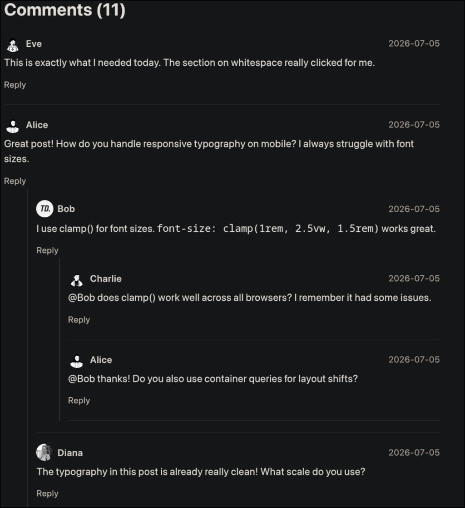

  

  <strong>A comment and webmention engine.</strong>
   
  Self-hosted. One binary. Your data.
   
  <a href="docs/getting-started.md">Getting started</a> · <a href="docs/api.md">API</a> · <a href="https://discord.gg/Q9fjx3gynN">Discord</a> · <a href="https://github.com/sponsors/nithitsuki">Sponsor</a>

---

# features

  fully custom UI left upto you!
   
  
   
  Basic screenshot of the a minimal UI frontend

#### Style it all you want
Zapiska is backend only. Use the included JS widget, build your own frontend, or pipe comments into a static site. The API gives you the data; how it looks is up to you.

#### Bring your own moderation (BYOM)
Hook in an LLM, a rules engine, a community blocklist, or the built-in dashboard. Zapiska doesn't decide what spam means—it's your call. Community moderation tools plug in via the admin API.

#### Threaded replies
Nested conversations supported, oldest-first within each thread. Prefer flat? Set depth to 0.

#### Webmention support
Accepts W3C webmentions, auto-fetches source pages, parses author profiles, and pulls in avatars.

#### Built-in spam protection
Rate limiting, per-IP daily caps, per-domain caps, honeypot fields, content-hash dedup, and URL cross-referencing. All configurable — you decide what to block.

#### One binary, zero dependencies
Rust and SQLite only. No Postgres, no Redis, no JS runtime. ~10MB, runs on a $5 VPS or a Raspberry Pi.
